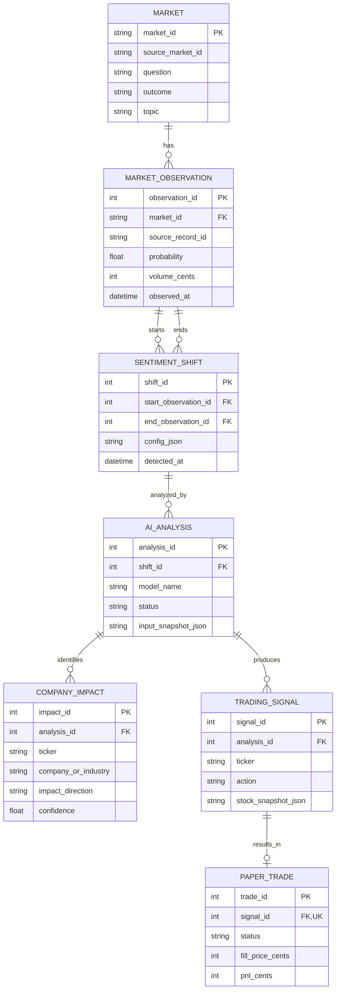

# D1_Detailed_Design

## 1. Header, scope, and conventions

**Project title:** Prediction Market Sentiment Trading System  
**Team members:** Vinesh and Charlie

### Goal statement

The system takes prediction market data from Polymarket, relevant news and social media information, and stock market data as input. The system outputs AI-generated company or industry impact analysis, trading signals, and paper trading results.

### Scope

D1 details **Data Storage**, **Sentiment Shift Detector**, and **AI Analysis Engine**; **Prediction Market Data Collector**, **Trading Signal Generator**, and **User Dashboard** are deferred to D2.

Vinesh owns the detector and AI engine. Charlie owns storage. Signal and paper-trade records are included because they belong to Data Storage; their processing logic remains in D2.

### Conventions

In Figure 1, boxes represent entities and rows show important attributes. Lines represent relationships. **PK** marks a primary key, **FK** a foreign key, and **UK** a unique key. Crow's-foot notation shows cardinality at both ends: `||` means exactly one, `o|` means zero or one, and `o{` means zero or many.

Timestamps use UTC. Probability and confidence range from 0 to 1. A probability change of 0.05 means five percentage points. Volume means cumulative traded volume in USD. Monetary values use integer cents in storage and decimal strings in the component contract.

**Requirement references:** US-01 covers detecting sentiment shifts; US-02 covers storing data with timestamps and sources; US-03 covers tracing signals to market data and AI analysis.

Thresholds and new technology selections below are proposed defaults for team review. Charlie's specific technology experience and the available AI hardware still need to be confirmed.

## 2. Data model, the D1 diagram

Data Storage uses a **relational model with SQLite**. Foreign keys preserve the links from market observations to shifts, analyses, signals, and paper trades. A simpler JSON or key-value store would require the team to maintain these relationships manually.

### Figure 1: Data Storage entity-relationship diagram



Use a dedicated page for the rendered diagram in the PDF. The Mermaid block is the figure source.

### Structural decisions

| Decision | Reason and requirement |
|---|---|
| Market is an entity with one tracked outcome per `market_id`. | Its question, outcome, and topic are shared by many observations. This avoids repetition and comparing different outcomes. US-01. |
| Market to Observation is one-to-many. | Each observation belongs to one tracked outcome, while that outcome has many observations over time. US-02. |
| Shift references its starting and ending observations. | Each shift uses two exact records from the same market. An observation can be used by multiple shifts, preserving the original evidence. US-01/US-03. |
| Shift to Analysis is one-to-many. | A shift may be analyzed again after failure or when new context becomes available; each analysis concerns one shift. US-03. |
| Company Impact is a separate entity. | One analysis can identify multiple companies or industries with different directions, confidence values, and reasoning. US-01. |
| Analysis to Signal is one-to-many; Signal to Paper Trade is zero-or-one. | An analysis may support several ticker signals. A signal may be rejected or produce one paper order; order-status updates modify that same trade record. US-03. |
| Store analysis and stock input snapshots. | Preserve the evidence used by AI and the stock price, volatility, timestamp, and source used by a signal. Analysis also stores summary, creation time, and failure code; impacts store reasoning and evidence IDs. US-02/US-03. |
| Index Observation on `(market_id, observed_at, observation_id)`. | Supports recent-data and lookback queries, with observation ID breaking timestamp ties. US-01. |
| Make `(market_id, source_record_id)` unique. | Prevents storing the same source update twice. US-02. |
| Make `(end_observation_id, config_json)` unique for shifts; index child foreign keys. | Prevents duplicate shift events under the same canonical configuration and speeds lineage queries. The unique trade `signal_id` enforces one order per signal. US-03. |

Enable foreign-key enforcement and validate probability bounds and nonnegative volume. Trade quantity and execution time are also stored; P&L remains nullable until calculated. Snapshot JSON is retained as an immutable input bundle rather than modeled as additional entities.

## 3. Core algorithms

### Algorithm 1: Sentiment Shift Detection

#### 1. What it is and the problem it solves

The detector identifies meaningful probability movement supported by trading activity. It implements US-01 and converts validated observations from I2 into the shift passed through I3.

Select the newest observation by timestamp, breaking ties with the largest observation ID. Select the latest baseline observation at or before the newest timestamp minus the lookback period. Require the baseline to be within `max_baseline_gap_seconds` of that target time.

```text
probability_delta = newest.probability - baseline.probability
volume_delta = newest.volume_usd - baseline.volume_usd

detect a shift when:
    abs(probability_delta) >= probability_threshold
    AND volume_delta >= volume_threshold_usd
```

Proposed defaults are a 900-second lookback, 120-second maximum baseline gap, probability threshold 0.05, and USD 1,000 volume increase. Store the two observation IDs and configuration with each detected shift.

#### 2. Inputs and outputs with exact types

Inputs are `market_id: string`, `lookback_seconds: int`, `max_baseline_gap_seconds: int`, `probability_threshold: float`, and `volume_threshold_usd: decimal string`. The detector queries stored observations.

The output is `DetectionResult`, containing a documented status and a `SentimentShift` or `null`. Section 5 defines the parameter ranges and exact output fields.

#### 3. Expected complexity at realistic size

For `N` stored observations, indexed observation lookups and duplicate checks take approximately **O(log N)**. Arithmetic and additional working memory are **O(1)**.

The initial target is 50 markets with 1,000 observations each, or 50,000 records. At 100 times the history, 5,000,000 records, indexed lookups still avoid full scans; storage and write contention need measurement. A full scan would take O(N). These are design estimates, not measured latency results.

#### 4. Why this algorithm rather than alternatives

A threshold rule is explainable and requires no labeled training data. An ML anomaly detector could find more complex patterns but adds training and tuning work. Moving averages could reduce noise but change how shifts are defined. The threshold rule provides a simple initial method to test.

#### 5. Edge cases and failure conditions

Empty history, too few observations, or a stale baseline returns `insufficient_data`. Values below either threshold return `no_shift`; exact threshold equality qualifies. Equal probabilities do not qualify because the probability threshold must be positive.

Duplicate observations are ignored, and repeated detection with the same newest observation/configuration returns the existing shift. Out-of-order records are stored but do not replace a newer timestamp. Negative volume change returns `invalid_volume_history`, indicating a reset or inconsistent data. Missing fields, invalid ranges, and storage failures use the errors in Section 5. These rules prevent unsupported events from entering I3.

### Algorithm 2: AI Company/Industry Impact Analysis

#### 1. What it is and the problem it solves

The local **Qwen3.5 9B** model interprets a detected shift and relevant news/social context to identify possible company or industry effects. It implements I3/I4 to I5 and stores results through I10, supporting US-01 and US-03.

Deduplicate context by ID, sort newest first with context ID breaking timestamp ties, and select items that fit the prompt budget. The context supplier is responsible for topic relevance. Include the market question, outcome, topic, shift, and selected evidence in a structured prompt. Validate the model's JSON output and store the evidence and results together.

#### 2. Inputs and outputs with exact types

Inputs are `shift_id: int` and `context_items: list<ContextItem>`. The model is configured on the server as Qwen3.5 9B.

The output is `AnalysisResult` with an analysis ID, shift ID, summary, and `list<CompanyImpact>`. Section 5 defines the exact types and ranges. Confidence is a model-reported score, not a calibrated probability of profit.

#### 3. Expected complexity at realistic size

For `k` context items and `L` input characters, preprocessing takes approximately **O(L + k log k)**. For fixed model weights, full-attention layers have an approximate attention-cost term **O(T² + TG + G²)** for `T` input tokens and `G` generated tokens. Qwen3.5 also uses linear-attention layers, so actual runtime depends on hardware and the inference implementation.

Limit each prompt to 3,000 input tokens and output to 500 tokens. At 100 times the number of shifts, total inference work grows approximately 100 times while each prompt remains bounded. Measure inference time and memory on the actual machine before claiming a processing rate.

#### 4. Why this algorithm rather than alternatives

Keyword matching is faster but can miss indirect relationships between an event and a company. A language model can interpret the event and supplied evidence together. A cloud AI API reduces local hardware needs but adds recurring charges and changes D0's local-model decision.

#### 5. Edge cases and failure conditions

Empty context produces `INSUFFICIENT_CONTEXT`. Empty or invalid model output produces `INVALID_MODEL_OUTPUT`; a valid result with no supported impacts succeeds with an empty list.

Combine exact duplicate impacts and mark conflicting directions for the same company as `mixed`. Permit `ticker: null` for industries or unverified company identities. Reject confidence outside 0–1 and references to evidence not included in the input. Model unavailability and timeout are explicit errors; store failed attempts and send no successful result through I5. D2 verifies ticker eligibility before generating a paper trade.

## 4. Build-versus-reuse decisions

| Significant piece | Build or reuse | Library/service | License | One-line evaluation and reason |
|---|---|---|---|---|
| Data schema and lineage queries | Build | Team SQL | Team repository license, to be selected | Project-specific relationships and indexes support US-02/US-03. |
| Database and driver | Reuse | SQLite; Python `sqlite3` | SQLite public domain; PSF License 2 | Established embedded database and standard driver; indexed local storage fits the workload, with serialized writes. |
| Shift detection rules | Build | Team detector | Team repository license, to be selected | Project-specific thresholds need deterministic, explainable behavior. |
| API framework and validation | Reuse | FastAPI; Pydantic | MIT | Established maintained projects; typed validation and OpenAPI fit the contract with modest processing overhead. |
| Backend server | Reuse | Uvicorn | BSD-3-Clause | Established ASGI server; fits FastAPI and lightweight local hosting. |
| Evidence selection and impact normalization | Build | Team AI adapter | Team repository license, to be selected | Project-specific mapping and bounded prompts control inference cost. |
| Model weights | Reuse | Qwen/Qwen3.5-9B | Apache-2.0 | Official published model fits D0; accuracy and local performance still require testing. |
| Inference runtime | Reuse | llama.cpp | MIT | Actively maintained local runtime with quantization; use a tested Qwen3.5-compatible build. |
| Local model HTTP client | Reuse | HTTPX | BSD-3-Clause | Established client with pooling and timeouts; fits requests to the local inference server. |
| Date parsing, JSON, and sorting | Reuse | Python standard library | PSF License 2 | Mature built-in implementations avoid unnecessary custom infrastructure. |

Pin the selected library versions and model/runtime revisions, and retain their required license notices.

## 5. API contract

This contract specifies **component methods**, which the assignment permits. FastAPI can expose them through backend routes during implementation.

All fields are required unless marked `?`. IDs are positive integers. Strings must be nonempty unless nullable. `UtcTime` is an ISO 8601 UTC string ending in `Z`. `USD` is a nonnegative decimal string with at most two fractional digits. Probability and confidence must be finite.

### Shared data types

```text
Observation = {
  observation_id: int,
  market_id: string,
  source_record_id: string,
  probability: float [0,1],
  volume_usd: USD,
  observed_at: UtcTime
}

SentimentShift = {
  shift_id: int,
  market_id: string,
  start_observation_id: int,
  end_observation_id: int,
  probability_delta: float [-1,1],
  volume_delta_usd: USD,
  window_start: UtcTime,
  window_end: UtcTime
}

DetectionResult = {
  status: "detected" | "no_shift" | "insufficient_data"
          | "invalid_volume_history",
  shift: SentimentShift | null
}

ContextItem = {
  context_id: string,
  source_type: "news" | "social",
  source_url: string (absolute HTTP/HTTPS URL),
  title: string,
  text: string,
  published_at: UtcTime
}

CompanyImpact = {
  ticker: string | null,
  company_or_industry: string,
  impact_direction: "positive" | "negative" | "mixed" | "neutral",
  confidence: float [0,1],
  reasoning: string,
  evidence_ids: list<string> (IDs of selected context)
}

AnalysisResult = {
  analysis_id: int,
  shift_id: int,
  model_name: string,
  summary: string,
  created_at: UtcTime,
  impacts: list<CompanyImpact> (0..10)
}

ComponentError = {
  code: string,
  message: string
}
```

### Key methods

| Method and D0 interface | Inputs: types, required/optional, and ranges | Exact output | Error codes and conditions |
|---|---|---|---|
| `save_observation` (Storage, I9) | Required: `market_id: string` (1–128 characters), `source_record_id: string` (1–256), `probability: float` [0,1], `volume_usd: USD`, `observed_at: UtcTime`. Market must exist. | `Observation`; an identical repeat returns the existing record. | `MARKET_NOT_FOUND`; `VALIDATION_ERROR` for invalid/missing fields; `SOURCE_RECORD_CONFLICT` for the same source ID with different data; `STORAGE_UNAVAILABLE`. |
| `detect_shift` (Detector, I2/I3) | Required: `market_id: string` (1–128). Optional: `lookback_seconds: int` [1,86400], default 900; `max_baseline_gap_seconds: int` [0,3600], default 120; `probability_threshold: float` (0,1], default 0.05; `volume_threshold_usd: USD`, default `"1000.00"`. | `DetectionResult`; `shift` is non-null only when status is `detected`. | `MARKET_NOT_FOUND`, `VALIDATION_ERROR`, `STORAGE_UNAVAILABLE`. Insufficient history is a normal result. |
| `analyze_shift` (AI, I3/I4/I5/I10) | Required: `shift_id: int`, `context_items: list<ContextItem>` (0–100 items). Each context ID is 1–128 characters, title 1–500, and text 1–10000. Model is server-configured. | `AnalysisResult` after validated results are stored. | `SHIFT_NOT_FOUND`; `VALIDATION_ERROR`; `CONTEXT_ID_CONFLICT` for conflicting copies; `INSUFFICIENT_CONTEXT`; `MODEL_UNAVAILABLE`; `MODEL_TIMEOUT`; `INVALID_MODEL_OUTPUT`; `STORAGE_UNAVAILABLE`. |

Methods return the specified success type or raise a `ComponentError` with the listed code and a message. Invalid AI responses are never passed to the Trading Signal Generator. Failure attempts are recorded when storage is available.

### Example request and response

This synthetic example calls `detect_shift` for a market with a probability change of 0.08 and USD 1,500 volume increase.

```json
{
  "method": "detect_shift",
  "inputs": {
    "market_id": "demo-outcome-yes",
    "lookback_seconds": 900,
    "max_baseline_gap_seconds": 120,
    "probability_threshold": 0.05,
    "volume_threshold_usd": "1000.00"
  }
}
```

```json
{
  "status": "detected",
  "shift": {
    "shift_id": 12,
    "market_id": "demo-outcome-yes",
    "start_observation_id": 101,
    "end_observation_id": 102,
    "probability_delta": 0.08,
    "volume_delta_usd": "1500.00",
    "window_start": "2026-10-07T19:00:00Z",
    "window_end": "2026-10-07T19:15:00Z"
  }
}
```

**Versioning:** Component methods and their input/output schemas use contract version `v1`; removing or renaming fields/methods, changing types or units, tightening accepted inputs, or changing documented result meanings requires a new major version.

## 6. Technology choices with justification

### Database: SQLite

**Team skill fit:** Vinesh has Python/SQLite project experience and SQL/BigQuery internship experience, supporting the team's database work. **Licensing:** SQLite is public domain. **Community support:** established documentation and widespread use provide implementation guidance. **Performance:** indexed queries fit the expected workload, although writes are serialized. **Cost and hosting:** it runs as a local file without a database subscription. PostgreSQL was passed over because a separate server and multiple concurrent writers are not initially needed.

### Backend: Python with FastAPI

**Team skill fit:** Vinesh's Python and Flask experience transfers to backend development; FastAPI requires some additional learning. **Licensing:** Python uses PSF License 2, FastAPI/Pydantic use MIT, and Uvicorn uses BSD-3-Clause. **Community support:** maintained projects and official documentation support the stack. **Performance:** typed validation and lightweight request handling fit the prototype; local model inference should run separately from collection. **Cost and hosting:** the backend can run on an existing computer without framework fees. Flask was passed over because FastAPI's validation and generated API documentation better match the proposed contract.

### Front end: React

**Team skill fit:** Vinesh has web-application front-end experience, while React-specific experience should be confirmed with Charlie, the dashboard owner. **Licensing:** React uses MIT. **Community support:** official documentation and a large ecosystem support reusable components. **Performance:** a bounded history display and backend filtering keep rendering manageable. **Cost and hosting:** the built dashboard can be served by the local backend without a separate hosting subscription. Server-rendered HTML was considered; React is proposed for interactive filtering and analysis views, with detailed UI design deferred to D2.

### Hardware platform: local Qwen3.5 9B with llama.cpp

**Team skill fit:** Vinesh's Python/AI project experience supports model integration, while local inference setup is a learning task. **Licensing:** Qwen3.5 9B uses Apache-2.0 and llama.cpp uses MIT. **Community support:** the official model and maintained runtime provide integration guidance. **Performance:** quantization can reduce memory demand, but speed and memory must be tested on the actual computer. **Cost and hosting:** existing hardware avoids per-call AI charges. A cloud AI API was passed over to preserve D0's local-model choice and limit recurring costs.

### Hosting: an existing team computer

**Team skill fit:** Vinesh has Ubuntu/Apache deployment experience, supporting initial local hosting. **Licensing:** deployment follows the selected operating system, library, and model licenses. **Community support:** the stack's official setup documentation supports local operation. **Performance:** backend, storage, and inference share hardware, so resource contention must be tested. **Cost and hosting:** existing hardware avoids a recurring cloud bill, although the computer must remain powered on. A cloud GPU VM was passed over because rental cost and deployment work are unnecessary until local performance is evaluated.

### License and technical references

- [SQLite](https://www.sqlite.org/copyright.html) and [concurrency](https://www.sqlite.org/wal.html).
- [Python](https://docs.python.org/3/license.html), [FastAPI](https://github.com/fastapi/fastapi), and [Pydantic](https://github.com/pydantic/pydantic/blob/main/LICENSE).
- [Uvicorn](https://github.com/Kludex/uvicorn) and [HTTPX](https://github.com/encode/httpx/blob/master/pyproject.toml).
- [React](https://github.com/react/react/blob/main/LICENSE).
- [Qwen3.5 9B](https://huggingface.co/Qwen/Qwen3.5-9B) and [llama.cpp](https://github.com/ggml-org/llama.cpp).
