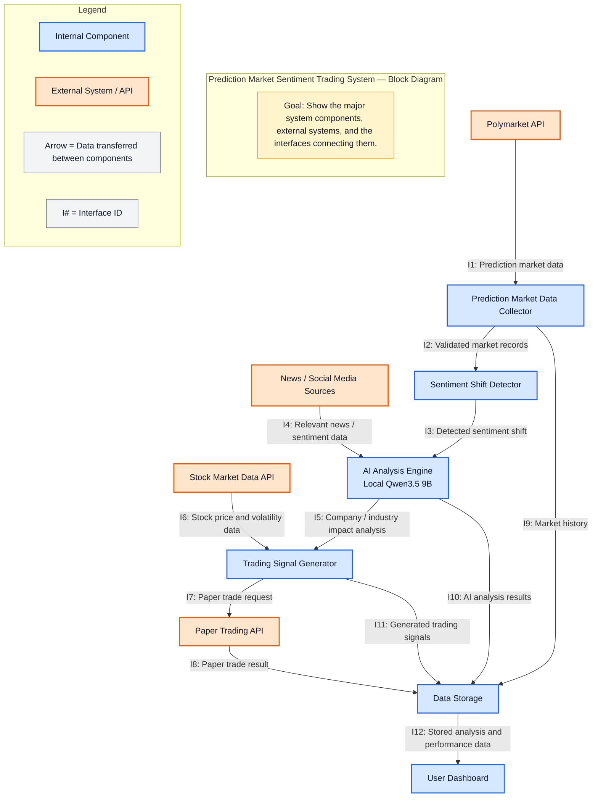
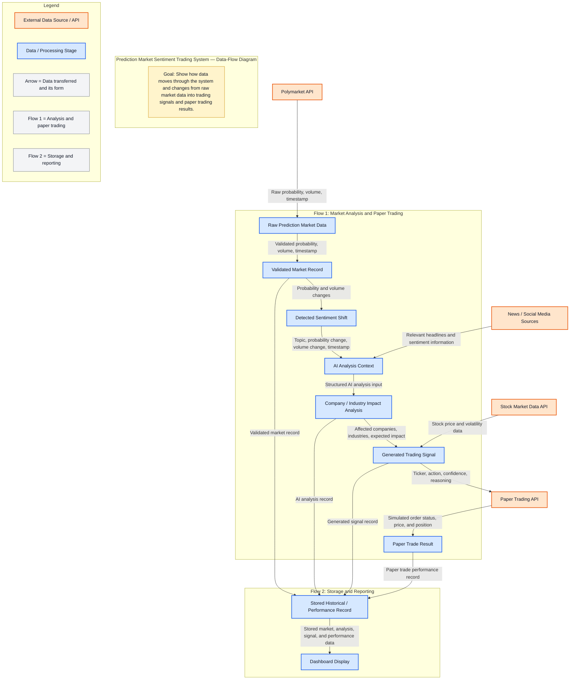

# D0 High-Level Design

**Basic Input and Output:** The system takes prediction market data from Polymarket, relevant news and social media information, and stock market data as input. The system outputs AI-generated company or industry impact analysis, trading signals, and paper trading results.

## Block Diagram (D0 Diagram)

## Component Responsibility Table

| Component | Responsibility | Interfaces In | Interfaces Out | Primary Owner |
|---|---|---|---|---|
| Prediction Market Data Collector | Collects and validates prediction market data from Polymarket. | I1 | I2, I9 | Vinesh |
| Sentiment Shift Detector | Detects significant changes in prediction market sentiment from validated market records. | I2 | I3 | Vinesh |
| AI Analysis Engine | Uses the local Qwen3.5 9B model to identify companies or industries potentially affected by a detected sentiment shift. | I3, I4 | I5, I10 | Vinesh |
| Trading Signal Generator | Generates a paper trading signal using the AI impact analysis and current stock market data. | I5, I6 | I7, I11 | Charlie |
| Data Storage | Maintains persistent records produced by the system for later retrieval. | I8, I9, I10, I11 | I12 | Charlie |
| User Dashboard | Displays stored analysis and paper trading performance data to the user. | I12 | None | Charlie |

## Data-Flow Diagram

## Architecture Pattern and Justification

The system uses a combination of **pipeline** and **client-server** architecture. The pipeline pattern controls the main flow from collecting prediction market data to AI analysis, trading signals, and paper trading. The client-server pattern is used for the dashboard, which gets stored results from the backend.

| Criteria | Justification |
|---|---|
| **Fit to the Problem** | A pipeline fits because data moves through clear stages from market data to trading signals. Client-server fits the dashboard because it separates the user interface from the backend. |
| **Team Skills** | Both patterns are familiar and allow the system to be divided into components that can be worked on separately. |
| **Performance and Timing** | The pipeline processes new market data as it becomes available. The local AI model may be the slowest stage, so keeping it separate makes its performance easier to test. |
| **Scalability** | Individual components can be improved or expanded without changing the entire system. More data sources could also be added later. |
| **Hardware Constraints** | Qwen3.5 9B runs locally, so AI performance depends on available CPU, GPU, and memory. Keeping AI analysis separate limits its effect on the rest of the system. |

### Rejected Pattern

**Microservices** was considered but rejected because it would add unnecessary networking and deployment complexity for a two-person project. Pipeline and client-server provide enough separation without the extra infrastructure.

## Decision Log

| Decision | Alternatives Considered | Reason for Decision |
|---|---|---|
| Use **Polymarket** as the prediction market data source. | Polymarket, multiple prediction markets | Polymarket provides the prediction market data needed for the project while keeping the scope manageable. |
| Use **Qwen3.5 9B locally** for AI analysis. | Local Qwen3.5 9B, cloud-based AI API | Running the model locally avoids API costs and gives the team more control over the AI analysis. |
| Use **paper trading** to evaluate generated signals. | Paper trading, real-money trading, historical backtesting only | Paper trading allows the system to test signals using market conditions without risking real money. |
| Use a **pipeline and client-server architecture**. | Pipeline and client-server, microservices | Pipeline fits the step by step data processing, while client-server separates the dashboard from the backend without adding the complexity of microservices. |
| Store **market data, AI analysis, signals, and trade results**. | Store all analysis data, store only final trading results | Storing each stage makes it possible to trace how a trading signal was generated and evaluate previous results. |
